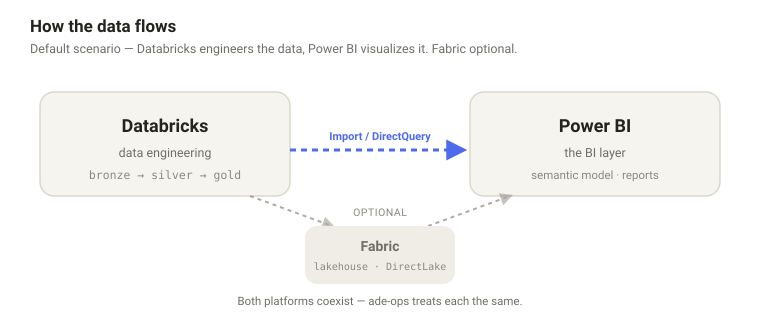
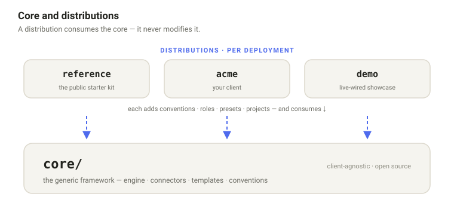

# ade-ops

> Most open-source data platform tools hand you a sample and walk away.
> **ade-ops asks what you have.**

An open-source framework for analytics teams operating across Databricks, Microsoft Fabric, and Power BI. The reference distribution doesn't ship as a static demo — it ships as a scenario-aware starter kit that asks about your environment, then scaffolds what fits.

**Status:** F1 public preview (early). Apache License Version 2.0. Maintained by **Roberto Butinar**.

---

<p align="center">
  
</p>

## What ade-ops does

- **Single source of truth in `src/`** with overlay-based transforms for multi-environment deployment.
- **Remote workspaces are authoritative.** Promotions across environments are visible — diff before push, no silent overrides.
- **The framework admits what it doesn't know.** Skills carry a `status:` field (`experimental` / `preview` / `stable`) so you can calibrate trust. Notebook converters tag output as `compat`, `light`, `heavy`, or `impossible` — the last two are your call, not the tool's.
- **Designed for human + agent operation.** ade-ops is usable from a plain CLI, but reaches its potential when paired with an AI coding assistant that can drive its skills.

## Three onboarding scenarios in V1

When you run the onboarding skill, ade-ops asks which scenario fits your environment:

| Scenario | When to pick it | Typical user |
|---|---|---|
| **`databricks-to-powerbi`** (default) | You have Databricks + Power BI (Pro/Premium). You want to manage notebooks + PBIR reports + semantic models end-to-end. | Most enterprise teams |
| **`databricks-to-fabric`** | You have Databricks + a Microsoft Fabric tenant and want the full medallion → Fabric lakehouse → DirectLake semantic model + Power BI report chain. | Teams targeting Fabric / DirectLake |
| **`databricks-only`** | You have only Databricks. No Fabric / no Power BI for now. You want notebook + job deployment per environment. | Pre-PBI teams, data-eng-focused teams |

<p align="center">
  
</p>

All scenarios are **BYO**: you bring your workspace, your notebooks, and your identity. ade-ops scaffolds the workflow.

Future scenarios (`fabric-only`, `playground-zero-setup` with synthetic sample data) are tracked for V2/V3.

## Quick start

ade-ops is **agent-driven in two phases**: a small terminal bootstrap, then
onboarding driven by an AI coding assistant.

```bash
git clone https://github.com/rbutinar/ade-ops.git
cd ade-ops
python -m venv .venv && source .venv/bin/activate   # Windows: .venv\Scripts\activate
pip install -r requirements.txt
npm i -g @anthropic-ai/claude-code                   # needs Node.js LTS
claude                                               # launch from inside the repo
```

Then, inside the Claude Code session, run the canonical entry point — it asks
which scenario fits and routes you to the matching setup:

```
/ade-ops-onboarding
```

**→ Full walkthrough** (prerequisites, credentials, verify, your first
operations): [`docs/getting-started/`](docs/getting-started/) ·
**per-scenario manual steps:** [`docs/quickstart/`](docs/quickstart/).

## Architecture

ade-ops separates the **framework core** from **per-deployment distributions**.

<p align="center">
  
</p>

```
ade-ops/
├── core/                              # Generic, client-agnostic
│   ├── engine/                        # config / overlay / state / operations
│   ├── connectors/                    # Databricks, Fabric, Power BI
│   ├── conventions/                   # naming, sanitization, status protocol
│   ├── playbooks/                     # operational patterns
│   └── templates/                     # scaffolding
│
└── distributions/                     # Per-deployment customization
    └── reference/                     # The public reference implementation
        └── projects/<project>/        # Self-contained: src + overlays + config
```

A distribution **consumes** `core/` without modifying it. Each project under a distribution is self-contained — its own config, credentials, overlays, and state.

The assembly pipeline (`src/` + `overlays/{env}.yaml` + `patches/{env}/` → deployed) is the contract.

### Two deployment shapes

ade-ops supports two operational shapes:

- **Community / self-service** (this repo): you clone, run onboarding, operate your own instance. Updates arrive via `git pull` from upstream. Feedback flows via GitHub Issues.
- **Enterprise** (not in this repo): a private lab managed by a framework operator, with a shared DevOps mirror and team-member sandboxes. Suitable for large governance-heavy teams. If you're investigating an enterprise deployment, open an issue tagged `enterprise-inquiry` or reach the maintainer directly.

## Documentation

Full docs live in [`docs/`](docs/):

- **[Getting started](docs/getting-started/)** — fresh machine → first operation
- **[Quickstarts](docs/quickstart/)** — per-scenario step-by-step setup
- **[Guides](docs/guides/)** — task-oriented how-tos
- **[Concepts](docs/concepts/architecture.md)** — architecture & the assembly pipeline
- **[Capabilities & tiers](docs/reference/capabilities.md)** — what's in the open-source edition
- **[Roadmap](ROADMAP.md)** — where the framework is heading

Reference for AI coding assistants: [`CLAUDE.md`](CLAUDE.md) (Claude Code) ·
[`AGENTS.md`](AGENTS.md) (Copilot / Codex / generic) · operational patterns in
[`core/playbooks/`](core/playbooks/), conventions in [`core/conventions/`](core/conventions/).

## Working with AI assistants

ade-ops is built around Claude Code (the `.claude/commands/*` skills and the
`CLAUDE.md` conventions) but the engine itself is agent-agnostic — the CLI
(`python -m core.cli`) works with any AI coding assistant. Three manifest
files live at the root, each auto-discovered by the tools that expect it:

| Your tool | Manifest read | Source |
|---|---|---|
| **Claude Code** | [`CLAUDE.md`](CLAUDE.md) | Anthropic native |
| **GitHub Copilot Chat** | [`.github/copilot-instructions.md`](.github/copilot-instructions.md) | GitHub native, auto-loaded |
| **OpenAI Codex CLI / Codex Cloud** | [`AGENTS.md`](AGENTS.md) | First-class adopter of the shared convention |
| **Cursor IDE** (recent) | [`AGENTS.md`](AGENTS.md) | Migrating from `.cursorrules` |
| **Aider, Continue, Cline, other generic agents** | [`AGENTS.md`](AGENTS.md) | Tool-agnostic fallback |

The three files share ~80% content (CLI usage, `src/` vs `state/` discipline,
never-do rules) and diverge on the ~20% that each tool can actually use —
Claude Code gets the full slash-command catalogue, Copilot gets a more
concise CLI-first walkthrough, AGENTS.md stays format-neutral.

### Maturity levels

All three tools can read and modify the repo via the CLI — that part is
fully agent-agnostic. Where the experience differs is in the higher-level
workflows:

- **Claude Code** is the optimised path: the `.claude/commands/*` skills
  encode multi-step agentic patterns (incremental PBI report editing,
  iterative visual feedback loops, role-aware confirmations) that the
  framework was originally designed around.
- **GitHub Copilot Chat** and **OpenAI Codex CLI** are supported at CLI
  level today, and at workflow level when the assistant can read and
  follow a skill body as a recipe. Single-shot operations (deploy a
  notebook, run a dry-run, query lineage, publish a sanitized version)
  work pari with Claude. Multi-step iterative loops with visual feedback
  (Power BI styling refinement, screenshot-driven validation) are more
  mature on Claude Code today — other tools can do them but with rougher
  edges as the MCP and agentic-loop tooling matures across the ecosystem.

In practice: if you're shipping single operations, any of the three works.
If you're doing iterative authoring with a screenshot-in-the-loop, Claude
Code currently gives the smoothest experience — and we expect this gap to
narrow as Copilot Agent and Codex CLI mature.

The slash commands (`/ops-*`, `/pbir-*`, `/databricks-*`, `/fabric-*`, …)
are Claude-Code-only — Copilot, Codex and other tools treat them as
documentation describing the equivalent multi-step CLI workflow.

## Project status

ade-ops is in **F1 public preview**. The framework engine, connectors, and operational skills are working and used in production by the maintainer's team. The reference distribution and onboarding flow are early — expect rough edges. Filing issues, even small ones, is the most valuable contribution at this stage.

See the [roadmap](ROADMAP.md) for where the framework is heading — direction, not dates.

A more curated **private preview** is being assembled for hands-on onboarding support. To express interest, [open a Private preview signup issue](https://github.com/rbutinar/ade-ops/issues/new?template=private_preview_signup.yml) — the form takes ~2 minutes, no sensitive info required. The maintainer follows up as slots open.

## Where to file what

| You want to… | Channel |
|---|---|
| Report a bug or unexpected behaviour | [Bug issue](https://github.com/rbutinar/ade-ops/issues/new?template=bug_report.yml) |
| Request a feature or scenario | [Feature issue](https://github.com/rbutinar/ade-ops/issues/new?template=feature_request.yml) |
| File structured feedback (severity, scenario, persona, proposed fix) | [Feedback issue](https://github.com/rbutinar/ade-ops/issues/new?template=feedback.yml) |
| Share open-ended thoughts, friction, half-formed ideas | [Feedback discussion](https://github.com/rbutinar/ade-ops/discussions/new?category=feedback) |
| Express interest in the private preview | [Private preview signup](https://github.com/rbutinar/ade-ops/issues/new?template=private_preview_signup.yml) |
| Disclose a security issue privately | [Private vulnerability reporting](https://github.com/rbutinar/ade-ops/security/advisories/new) |

Not sure which fits? Default to the [Feedback discussion](https://github.com/rbutinar/ade-ops/discussions/new?category=feedback) — easier to redirect from there than to overthink up front.

## Contributing

See [CONTRIBUTING.md](CONTRIBUTING.md) for development setup, branch strategy, commit conventions, and the PR process.

Project participation is governed by the [Contributor Covenant Code of Conduct](CODE_OF_CONDUCT.md).

Contributions of any size are welcome — bug reports, doc clarifications, scenario gaps, and code.

## License

[Apache License Version 2.0](LICENSE). Copyright 2026 Roberto Butinar.

## Maintainer

**Roberto Butinar** — <https://github.com/rbutinar>

For non-issue questions, use [GitHub Discussions](https://github.com/rbutinar/ade-ops/discussions). For security disclosures, use GitHub's [private vulnerability reporting](https://github.com/rbutinar/ade-ops/security/advisories/new) channel.

## Acknowledgments

ade-ops is shaped by real production work and external collaboration. Contributor names land here as PRs land.
