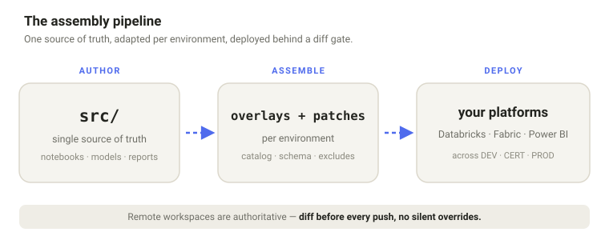

---
hide:
  - navigation
---

# ade-ops

**Operate your analytics platform — whichever one you run.**

ade-ops is an open-source framework for operating analytics platforms safely,
with humans and AI agents working together. Databricks, Microsoft Fabric, or
both — author once, operate everywhere, with the **same engine treating every
platform the same way**.

A single source of truth in `src/` is deployed to multiple environments through
declarative overlays, and **every write to a remote environment is gated by
explicit confirmation** — diff before push, no silent overrides.

-   :material-rocket-launch: **[Get started](getting-started/README.md)**

    From a fresh machine to your first operation — the two-phase bootstrap +
    scenario-aware onboarding.

-   :material-school: **[Learn](learn/index.md)**

    Guided learning modules with hands-on labs — start by operating a Databricks
    project end to end in ~5 minutes.

-   :material-book-open-variant: **[Concepts](concepts/architecture.md)**

    How it's built and why — the core/distribution split, the assembly pipeline,
    and the maturity convention.

-   :material-view-list: **[Reference](reference/capabilities.md)**

    What the open-source edition does today, and how the tiers compare.

!!! note "Public preview"
    ade-ops is in early public preview — expect rough edges, and please
    [file what you hit](https://github.com/rbutinar/ade-ops/issues/new/choose).
    Built and maintained in the open by **Roberto Butinar**.
